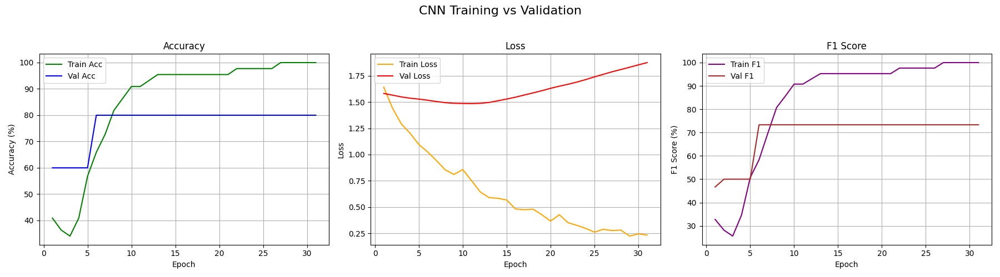

# BdSL_Interpreter

A deep learning-based Bangla Sign Language (BdSL) interpreter using neural networks, SVM, and LightGBM. It classifies sign gestures using the **BdSL47** dataset and compares multiple model performances through visualizations.

---

## 📂 Dataset

- **Dataset Name:** BdSL47 (Bangla Sign Language 47 classes)
- **Source:** [Dataverse Harvard - BdSL47](https://dataverse.harvard.edu/dataset.xhtml?persistentId=doi%3A10.7910%2FDVN%2FEPIC3H)
- ⚠️ *Dataset not included here.* Please download it manually from the above link and extract into the structure below:

```
bdsl47_dataset/
└── dataverse_files/
    ├── Bangla Sign Language Dataset - Sign Digits/
    └── Bangla Sign Language Dataset - Sign Letters/
```

---

## 🗂️ Project Structure

```
BdSL_Interpreter/
│
├── data_loader.py             # Dataset loading from CSV
├── model.py                   # ANN, CNN, CNN2 model architectures
├── train.py                   # Training for ANN/CNNs
├── train_lightgbm.py          # LightGBM model
├── train_svm.py               # SVM classifier
├── plot_training_curve.py     # Accuracy/Loss/F1 plotting
├── plot_results.py            # Confusion matrices & comparisons
├── requirements.txt           # Python dependencies
├── visualization_images/      # Plots, confusion matrices, performance charts
└── README.md                  # This file
```

---

## Models Used

| Model     | Description                               |
|-----------|-------------------------------------------|
| **ANN**   | Fully-connected deep neural network       |
| **CNN**   | Shallow 2-layer convolutional network     |
| **CNN2**  | Deep 4-layer convolutional neural network |
| **SVM**   | Support Vector Machine (RBF kernel)       |
| **LightGBM** | Gradient boosting decision trees       |

---

## 📈 Visualizations

### 🔁 Training vs Validation Metrics

| ANN | CNN | CNN2 |
|-----|-----|------|
|  |  |  |

---

### 🔷 Confusion Matrices

| ANN | CNN | CNN2 |
|-----|-----|------|
|  |  |  |

| LightGBM | SVM |
|----------|-----|
|  |  |

---

### 📊 Accuracy & F1 Comparison


---

## ⚙️ How to Run

1. **Clone this repository:**
```bash
git clone https://github.com/your-username/BdSL_Interpreter.git
cd BdSL_Interpreter
```

2. **Install the dependencies:**
```bash
pip install -r requirements.txt
```

3. **Place the dataset as shown above**

4. **Train the models:**
```bash
python train.py
python train_lightgbm.py
python train_svm.py
```

5. **Generate visualizations:**
```bash
python plot_training_curve.py
python plot_results.py
```

---

## 📦 Dependencies

- Python 3.8+
- PyTorch
- NumPy
- Pandas
- Matplotlib
- Scikit-learn
- LightGBM

Install everything via:

```bash
pip install -r requirements.txt
```

---

## Credits

The **BdSL47** dataset belongs to its original authors, available at [Harvard Dataverse](https://dataverse.harvard.edu/dataset.xhtml?persistentId=doi%3A10.7910%2FDVN%2FEPIC3H).  
This repository is for **academic use only**.

---

##  Author

**Fabliha Akther Fairuz**  

---

